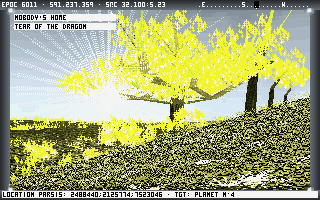

# Noctis IV Plus

This is the home of Noctis IV Plus, a basic modification of Alessandro Ghignola's excellent [Noctis IV](https://80.style/#/hsp/noctis_iv/noctis_iv_download_JmsLdos_onlyK) space exploration simulator.



For a list of changes, see [source/NIVPLUS_CHANGES.TXT](source/NIVPLUS_CHANGES.TXT)

For the manual, see [manual/noctis_iv_manual.html](manual/noctis_iv_manual.html)

## Getting Noctis IV Plus to run on modern computers

Noctis IV was made for MS-DOS and early Windows versions that still supported 16-bit MS-DOS executables natively, and as such, you'll need to be able to run DOS on your computer. To run Noctis IV plus on modern computers, you have three main options, in order of simplest to most complicated to setup:

1. [DosBOS-X](https://dosbox-x.com/) (all modern operating systems)
2. [DOSEMU](http://www.dosemu.org/) (Linux only)
3. A [FreeDOS](https://www.freedos.org/) or MS-DOS environment running inside of a virtual machine like [VirtualBox](https://www.virtualbox.org/)

The author of Noctis IV Plus recommends DosBOS-X, using the "dynamic_x86" CPU core, simulating a Pentium III 866MHz EB (~407000 cycles). Note that with this setup, a completely empty Stardrifter floating in space may actually give you *lower* frames per second than one that's orbiting a planet in a star system. You may want to play around with the cycle count a bit to find the right number for your computer.

Once you've got an MS-DOS setup running, simply run the following from within the MS-DOS environment:

```batch
cd <directory where NIVPlus is installed>
cd modules
noctis.exe
```

## Compiling

To compile Noctis IV Plus, follow these steps:

1. Get a working MS-DOS setup, as per the above.
2. Install Borland C++ 3.1 for DOS to `c:\bc.31`
3. Run the following from within the MS-DOS environment:
```batch
cd <directory where NIVPlus is installed>
cd source
compile.bat
```
