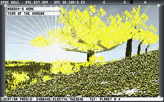

# Noctis IV Plus

This is the home of Noctis IV Plus, a basic modification of Alessandro Ghignola's excellent [Noctis IV](https://80.style/#/hsp/noctis_iv/noctis_iv_download_JmsLdos_onlyK) space exploration simulator.



For a list of changes, see [source/docs/NIVPLUS_CHANGES.TXT](source/docs/NIVPLUS_CHANGES.TXT)

For the manual, see [manual/noctis_iv_manual.html](manual/noctis_iv_manual.html)

To read the manual online, visit [https://nimaid.github.io/noctisiv/](https://nimaid.github.io/noctisiv/)

## Getting Noctis IV Plus to run on modern computers

Noctis IV was made for MS-DOS and early Windows versions that still supported 16-bit MS-DOS executables natively, and as such, you'll need to be able to run DOS on your computer. To run Noctis IV plus on modern computers, you have three main options, in order of simplest to most complicated to setup:

1. [DOSBox-X](https://dosbox-x.com/) (all modern operating systems)
2. [DOSEMU](http://www.dosemu.org/) (Linux only)
3. A [FreeDOS](https://www.freedos.org/) or MS-DOS environment running inside of a virtual machine like [VirtualBox](https://www.virtualbox.org/)

### DOSBox-X (recommended)

The `Launch.bat` script lets you run Noctis IV Plus with a simple double-click on Windows systems. It expects DOSBox-X to either be installed in it's default location `C:\DOSBox-X\dosbox-x.exe`, or installed portably with it's `bin` folder placed in the main `Noctis-IV-Plus` folder.

The `Launch.bash` script lets you run Noctis IV Plus with a simple double-click on \*nix systems. It expects DOSBox-x to be installed via `snap`.

If you are using a system other than Windows or Linux, simply run the following command:
```
dosbox-x -c "mount n '<directory where NIVPlus is installed>'" -c "n:" -c "cd modules" -c "NOCTIS.EXE" -conf dosbox.conf -exit
```

### Other DOS Emulators

Run the following commands in your DOS environment:
```batch
cd <directory where NIVPlus is installed>
cd modules
noctis.exe
```

## Compiling

*For a more detailed guide, [click here](source/README.md).*

To compile Noctis IV Plus, follow these steps:

1. Get a working MS-DOS setup, as per the above.
2. Install [Borland C++ 3.1 for DOS](https://archive.org/download/bcpp31/BCPP31.ZIP) to `Noctis-IV-Plus\bc.31`
3. Run the build command:
  - Windows: Double-click `source\Build.bat`.
  - \*nix: Double-click `source\Build.bash`.
